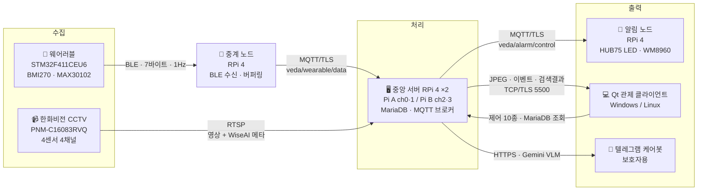

# 🏥 다보이조 — 요양원 어르신 안전 모니터링 시스템

**웨어러블 · CCTV 융합 기반 낙상/침상이탈 감지 및 상태 모니터링**

> 입소자 웨어러블(STM32)과 한화비전 지능형 CCTV를 **서로 독립적인 두 판정 경로**로 운영하고,
> 같은 사고를 양쪽이 잡으면 하나로 합쳐 기록하는 방식으로 낙상 골든타임을 확보하는
> 실버케어 관제 솔루션입니다.

- **팀**: 다보이조 (VEDA 4기 최종 프로젝트)
- **기간**: 2026. 7. 2 ~ 9. 1 (9주)
- **팀원**: 전승현(팀장) · 김예훈 · 박민용 · 이교민 · 홍성준

---

## 1. 시스템 구성



| 계층 | 구성 요소 | 역할 |
| --- | --- | --- |
| **수집** | 한화비전 CCTV **PNM-C16083RVQ** (4센서 멀티디렉셔널) | RTSP 스트리밍 + **WiseAI 객체 감지 메타데이터** (한 연결에 영상·메타 동시) |
| **수집** | 웨어러블 (STM32F411CEU6) | BMI270 IMU 낙상 감지·만보기, MAX30102 PPG 심박/SpO2, 착용 판정 |
| **수집** | 중계 노드 (RPi 4) | HM-10 BLE 수신 → 패킷 재조립·검증 → 단절 대비 버퍼링 → MQTT 발행 |
| **처리** | 중앙 서버 (RPi 4 **2대**) | RTSP 수신·디코딩, 자세 추정 낙상 판정, 침상이탈, 프라이버시 블러, 블랙박스/NVR, DB, MQTT |
| **출력** | 알림 노드 (RPi 4) | MQTT 구독 → **직접 구현한 커널 드라이버**로 HUB75 LED 경보 + WM8960 오디오 사이렌 |
| **출력** | Qt 관제 클라이언트 | 4분할 실시간 관제, 이벤트 로그, 일일 리포트, 입소자 관리, 카메라 원격 제어 |
| **출력** | 텔레그램 케어봇 | 보호자용 알림 + 버튼 메뉴(실시간 상황 조회·영상 검색) |

> **2-Pi 분할**: RPi 4 한 대로 4채널 디코딩 + 자세 추정을 감당하기 어려워 채널을 2+2로
> 나눴습니다. Pi A가 MariaDB와 MQTT 브로커를 함께 호스팅하고, 두 Pi가 같은 DB를 공유합니다.

---

## 2. 낙상 판정 — 두 경로의 독립 판정 + 사후 교차 검증

**두 경로는 서로를 기다리지 않습니다.** 어느 쪽이든 먼저 확정하면 즉시 경보합니다.

```
[카메라]   WiseAI bbox → 침대 ROI 게이팅 → MoveNet 자세 판정 → 지속 확인 ─┐
                                                                        ├─→ 즉시 경보
[웨어러블]  BMI270 → 자유낙하 → 충격 → 5초 정지 → 착용 확정 ─────────────┘
                                                                            │
              DB 기록 시: 5초 안의 같은 사람·같은 종류·다른 경로 → source = BOTH 로 승격
```

| 경로 | 판정 방식 |
| --- | --- |
| **카메라** | 침대 ROI 안은 무시(취침) → ROI 밖 사람만 bbox 크롭 → **MoveNet Thunder**로 자세 추정 → 몸통 기울기 · 상하 반전 · 원근 단축 **3신호 OR** + 하체 veto → 일정 시간 지속 시 확정 |
| **웨어러블** | SVM < 0.75g 자유낙하 3샘플 연속 → SVM > 2.5g 충격 → 5초간 정지 → **착용 확정 상태**일 때만 신고 |

### ⚠️ AND가 아니라 OR인 이유

기획 단계에서는 두 신호의 **AND**로 확정할 계획이었으나, 구현하면서 OR로 변경했습니다.
AND로 묶으면 **웨어러블 미착용·배터리 방전 시 낙상을 통째로 놓칩니다.** 안전 시스템에서
"둘 다 맞아야 알린다"는 놓침(false negative)을 구조적으로 만드는 설계입니다.

대신 중복 집계 문제는 **기록 단계에서** 해결했습니다. 먼저 온 쪽이 즉시 INSERT하고,
나중에 온 쪽이 5초 창 안의 같은 사건을 찾으면 그 행의 `source`를 `BOTH`로 올립니다.
알람은 지연 없이 나가고 리포트는 1회로 셉니다. `BOTH`는 **양쪽이 함께 본 낙상**이라
신뢰도가 더 높다는 정보이기도 합니다.

> 5초 창은 펌웨어가 낙상 플래그를 유지하는 시간(`HM10_FALL_HOLD_MS`)과 같은 값입니다.

---

## 3. 통신 구간

| 구간 | 방식 | 정의 위치 |
| --- | --- | --- |
| 웨어러블 → 중계 노드 | **BLE** (HM-10 투과모드), 7바이트 바이너리 + XOR 체크섬, 1Hz | `firmware/App/Drivers/hm10.h` |
| 중계 노드 → 서버 | **MQTT/TLS** `veda/wearable/data` — `WearableData` JSON | `MQTT/MQTT_prod/veda_messages.hpp` |
| 서버 → 알림 노드 | **MQTT/TLS** `veda/alarm/control` — `AlarmCommand` JSON | `MQTT/MQTT_prod/veda_messages.hpp` |
| 카메라 → 서버 | RTSP (영상 H.264 + ONVIF 메타데이터 트랙 동시 수신) | `docs/wiseai-메타데이터-명세.md` |
| 서버 → Qt (영상·이벤트·검색결과) | TCP + **OpenSSL TLS**, 매직 넘버로 3종 구분 | `protocol/video_stream.h` |
| Qt → 서버 (제어) | 같은 TCP 연결의 역방향, 제어 메시지 10종 | `protocol/video_stream.h` |
| 서버 → 카메라 (제어) | ONVIF Imaging (WS-Security), 한화 SUNAPI (HTTP Digest) | `server/video/onvif_imaging.*`, `sunapi_focus.*` |
| Qt ↔ DB | MariaDB 직결 (조회 전용 — 기록은 서버가 담당) | `client/main.cpp` |

**QoS 정책**: 바이탈은 QoS 0(빠르게, 유실 감수), 낙상은 QoS 1(반드시 전달).

**TLS**: MQTT 브로커(8883)와 영상 스트림(5500) 모두 자체 CA(`DavoCA`)로 발급한 인증서를
검증합니다. 발급은 `MQTT/scripts/generate_certs.sh`, `generate_stream_certs.sh`.

---

## 4. 핵심 기능

### 🎥 영상 (`server/`)

- **RTSP 4채널 수신** — libav 직접 사용으로 영상 + WiseAI 메타데이터를 한 연결에서 수신, 자동 재연결
- **프라이버시 블러** — 상시 전원 얼굴 블러가 기본. 낙상 확정 시에만 **넘어진 사람 얼굴만** 원복하고 나머지는 계속 블러
- **낙상 감지** — 침대 ROI 게이팅 + MoveNet 자세 추정 (위 2절)
- **침상 이탈** — 위험도 3단계(상=즉시 / 중=야간 22–06시 / 하=미알림), 침대 단위 관리
- **입소자 귀속** — 얼굴 인식 없이 **침대를 앵커로** 추적 객체에 사람을 매핑, 신뢰도 0.5 미만은 "미상"
- **요양보호사 감지** — 유니폼(주황 긴팔) 색 판정 → 케어 세션 타이머 → `care_logs` 기록. 평균 채도를 주 판정으로, 색 면적비는 하한 보증으로 사용(초기엔 조끼로 검증했으나 색 면적이 작아 오탐이 나서 긴팔로 교체)
- **블랙박스** — 이벤트 전후 5초씩 mp4 저장(remux only), HTTP Range 지원으로 Qt 즉시 재생
- **NVR 연속 녹화** — 10분 세그먼트, 보존기간 자동 삭제, USB 마운트 검증
- **카메라 원격 제어** — ONVIF 밝기/대비/채도, SUNAPI SimpleFocus(전체·영역), 런타임 RTSP 연결

### 🤖 AI 연동 (`server/`)

- **케어봇(텔레그램)** — 보호자가 버튼으로 실시간 상황 조회(Gemini VLM이 최근 키프레임 설명), 연락처 확인, 알림 무음 토글
- **자연어 영상 검색** — "어제 저녁에 낙상 있었어?" → 사건 유형·시간 범위로 구조화 → 이벤트 조회 → 클립 링크 회신. Qt 관제 화면과 케어봇이 같은 로직 공유

### 📟 웨어러블 (`firmware/`)

- BMI270 FIFO 블록 단위 **낙상 3단계 판정** (자유낙하 → 충격 → 정지)
- MAX30102 PPG 기반 **심박·SpO2**, 모션 블랭킹으로 움직임 구간 제외
- **만보기** — 착용 여부와 무관하게 상시 계수, 케이던스 검증
- **착용 판정** — 맥박 검출 기반. 미착용 시 낙상 확정 보류
- 저전력 — WFI Sleep / Stop Mode 전환 (Stop 진입 시 클럭 복구 처리)

### 🔔 알림 노드 (`alert-node/`)

- **HUB75 64×32 LED 커널 드라이버 직접 구현** — `isolcpus=3`로 리프레시 전용 코어 분리, `FBIO_WAITFORVSYNC` 동기화
- **WM8960 오디오 코덱 커널 드라이버 직접 구현** — ALSA 재생
- 호실을 앞세운 짧은 문구 스크롤(`301호 낙상 발생`), 등급별 색상, 신규 경보 깜빡임

### 🖥️ 관제 클라이언트 (`client/`)

- **실시간 관제** — 4분할/레이아웃 프리셋, 채널 확대, 경보 배너, 인터콤 방송
- **침대 ROI 편집** — 화면에 직접 그리기, 침대 ↔ 입소자 매핑 (서버가 DB에 영속화)
- **이벤트 로그** — 필터·확인 처리, 클릭 시 블랙박스 클립 재생 / NVR 구간 점프 / 다운로드
- **타임라인 재생** — 과거 구간 탐색
- **일일 리포트** — 재실 시간·케어 시간·이벤트 집계, 24시간 활동량 그래프, **PDF 내보내기**, **AI 요약**
- **입소자 관리** — 등록·수정·퇴소·재입소, 위험도 설정, 변경 이력
- **계정** — 로그인/회원가입, **PBKDF2-HMAC-SHA256** 비밀번호 해싱
- **알림 노드 제어** — HUB75 미리보기, 테스트 발행, 경보 원격 해제
- 다크/라이트 테마, 네이티브 다크 타이틀바(Windows)

---

## 5. 폴더 구조

```
daboyijo/
 ├─ server/          # 중앙 서버 (RPi 4 ×2)
 │   ├─ src/         #   진입점(조립도) · 설정 · 시스템 통계
 │   ├─ modules/     #   ★ 기능별 모듈 (낙상/침상이탈/요양사/블랙박스/NVR/케어봇/MQTT…)
 │   ├─ core/        #   저수준 부품 (스트림 서버 · DB · 침대 ROI · 귀속 · 클립 HTTP)
 │   ├─ video/       #   저수준 부품 (RTSP · 메타 파서 · 블러 · 자세추정 · 녹화 · ONVIF/SUNAPI)
 │   └─ models/      #   MoveNet Thunder int8 (.tflite)
 ├─ MQTT/            # MQTT 공용 구현(MQTT_prod) · 개발 트리(MQTT_dev) · 인증서 스크립트
 ├─ client/          # Qt 관제 클라이언트 (Qt 6.5, CMake)
 ├─ firmware/        # STM32 웨어러블 펌웨어 (App/Drivers · App/Algorithms)
 ├─ relay-node/      # 중계 노드 — BLE 수신·버퍼링·MQTT 발행
 ├─ alert-node/      # 알림 노드 — 커널 드라이버(hub75/wm8960) + MQTT 구독 앱
 ├─ protocol/        # ★ 전 모듈 공통 패킷 구조체·메시지 타입 정의
 └─ docs/            # 설계 문서 · 실측 명세 · 주차별 산출물
```

각 폴더의 `README.md`에 해당 모듈의 빌드·설정·트러블슈팅이 정리되어 있습니다.
서버 모듈 구조와 협업 규칙은 [`server/ARCHITECTURE.md`](server/ARCHITECTURE.md) 참조.

---

## 6. 빌드 · 실행

```bash
# 중앙 서버 (RPi 4)
cd server
cp config/cameras.conf.example config/cameras.conf   # 카메라·토큰·키 설정 (gitignore됨)
make && make run
```

```bash
# 중계 노드
cd relay-node && ./install_deps.sh
cmake -S . -B build && cmake --build build && ./relay_node
```

```bash
# 알림 노드
cd alert-node && make
sudo ./scripts/load.sh && sudo ./app/alert-node
```

Qt 클라이언트는 Qt Creator에서 `client/CMakeLists.txt`를 엽니다.
AI 요약을 쓰려면 CMake 변수 `DABOYIJO_GEMINI_KEY`를 지정해야 합니다.

서버는 5초마다 채널별 fps·CPU·SoC 온도를 출력합니다.
**부하 기준: CPU 70% 이하, 온도 70°C 이하, 전 채널 12fps 이상.**

---

## 7. 모듈별 담당

| 모듈 | 담당 |
| --- | --- |
| `server/` (영상 파이프라인 · 판정 · DB · 케어봇) | 박민용, 홍성준 |
| `firmware/` (STM32 웨어러블) | 김예훈, 이교민, 전승현 |
| `relay-node/` · `alert-node/` (드라이버 · MQTT) | 김예훈, 이교민, 전승현 |
| `client/` (Qt 관제) | 전체 |
| `protocol/` (공통 규격) | 전체 합의 |

---

## 8. 기술 스택

- **언어/빌드**: C / C++17, Make, CMake
- **서버**: Raspberry Pi OS, OpenCV, FFmpeg(libav), **TensorFlow Lite (MoveNet Thunder)**, OpenSSL, libcurl, MariaDB, mosquitto, Google Gemini API
- **클라이언트**: **Qt 6.5** (Widgets · Network · Sql · Multimedia · Mqtt), QSslSocket, QPdfWriter
- **펌웨어**: STM32CubeIDE 1.18.1, CubeMX 6.14.1, HAL, I2C/SPI/UART, USB CDC
- **노드**: 리눅스 커널 모듈(HUB75 · WM8960), ALSA, SimpleBLE, libmosquitto
- **카메라 연동**: RTSP, ONVIF (Imaging · WS-Security), 한화 SUNAPI
- **협업**: Git/GitHub, Jira(KAN), Notion

---

## 9. 브랜치 전략

```
main     ← 발표/시연 가능한 안정 버전 (마일스톤 단위 머지)
develop  ← 통합 브랜치. 모든 PR의 대상 (기본 브랜치)
feat/... ← 기능 브랜치. 예: feat/server-rtsp-4ch, feat/firmware-imu-fall
fix/...  ← 버그 수정
```

**규칙**

1. `main`, `develop`에 직접 push 금지 — 반드시 PR
2. PR 리뷰어 1명 이상 (같은 모듈 담당자 우선)
3. 브랜치명은 `타입/모듈-작업` 형식

## 10. 커밋 컨벤션

```
feat: RTSP 4채널 수신 파이프라인 구현 (KAN-12)
```

- 타입: `feat` `fix` `refactor` `docs` `chore` `test`
- 끝에 Jira 이슈 키 `(KAN-nn)` 를 붙이면 Jira에 자동 연동됩니다.
